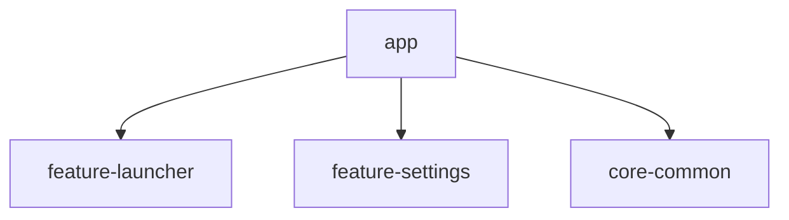
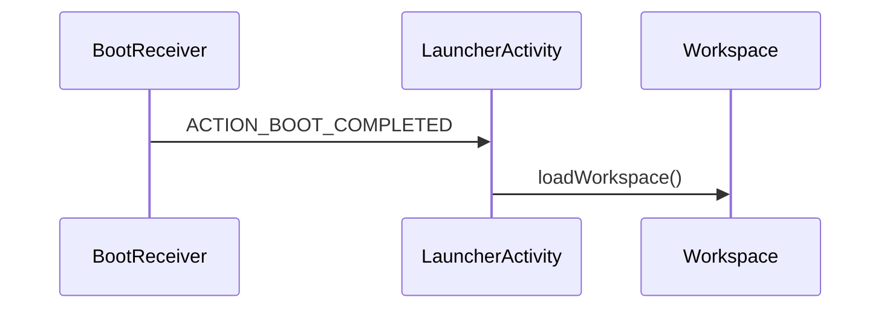

<!-- project-map.md 模板 v2 — 用锚点 ID 替代易变的 §编号 -->
<!-- 填充后放在项目 .agent/project-map.md。目标 < 1000 行 / < 30k token。-->
<!-- agent 进项目后，先读 .agent/project-skill.md 了解工作流，再按需读本文件的具体章节。-->

# 项目知识地图

> 本文件是项目的"知识地图"（查索引用）。agent 进项目先读 `.agent/project-skill.md` 了解流程，再按需读本文件的具体章节。
> **引用本文件用锚点**：`[入口](.agent/project-map.md#sec-entry)`，不用 §编号。

> 最后更新: <YYYY-MM-DD HH:MM> · git commit: <short_sha>
> 项目类型: <automotive|mobile|universal>

## 1. 项目元信息

| 项 | 值 |
|---|---|
| 项目名 | <一句话定位> |
| 类型 | <AOSP整包 / 多模块Gradle / 单应用> |
| 车机/手机 | <automotive / mobile / universal> |
| minSdk / targetSdk | <版本> |
| 主要语言 | Kotlin <X>% / Java <Y>% |
| 模块数 | <N> |

## 2. 模块拓扑

| 模块 | 路径 | 职责 |
|---|---|---|
| app | ./app | 主入口 |
| feature-xxx | ./feature/xxx | <职责> |

## 3. 核心入口与生命周期

| 入口类 | 路径 | 说明 |
|---|---|---|
| Launcher | packages/apps/.../Launcher.java | 桌面主入口 |
| MainActivity | app/src/.../MainActivity.kt | <说明> |

主启动流程：

## 4. 主业务流程

| 流程名 | 入口 | 关键类 |
|---|---|---|
| <流程1> | <入口> | <类列表> |

## 5. IPC 接口清单

### 5.1 AIDL
| 接口 | 路径 | 关键方法 |
|---|---|---|
| ICarService | .../ICarService.aidl | getVehicleSpeed() |

### 5.2 Car API（仅 automotive）
| Manager | 用途 |
|---|---|
| CarPropertyManager | 车辆属性读写 |

### 5.3 Intent Filter
| Action | 接收方 |
|---|---|
| ACTION_BOOT_COMPLETED | BootReceiver |

## 6. 系统权限与签名

| 项 | 值 |
|---|---|
| sharedUserId | <android.uid.system 或无> |
| 签名 | <platform / release> |
| 特权权限 | <列表> |

## 7. 构建与运行

| 命令 | 用途 |
|---|---|
| ./gradlew assembleDebug | 编译 debug |
| ./gradlew :app:test | 跑测试 |

## 8. 关键约定引用

指向 `arch-rules` 的 conventions（按 project_type 加载）：
- universal → conventions/universal.md
- automotive → + conventions/automotive.md, launcher.md, settings.md, system-app.md
- mobile → + conventions/mobile.md

## 9. 变更日志

> 只 append / 顶部插入，不修改历史行。每行 < 30 汉字。

| 时间 | commit | 类型 | 区块 | 摘要 |
|---|---|---|---|---|
| YYYY-MM-DD | a1b2c3d | 新增类 | #sec-entry | 新增 FooActivity |

## 10. 已知未知

> agent 识别不确定的项记这里，下次 sync 保留，需人工修正。

- <不确定项1>
