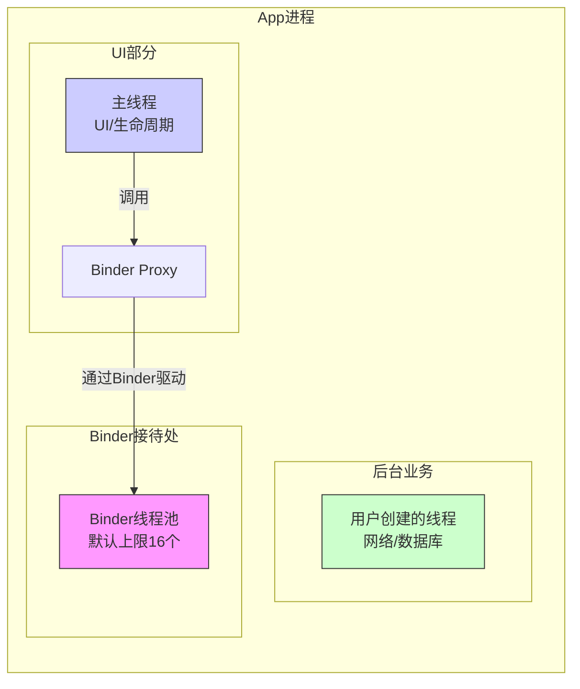

# Android AIDL 进阶指南：从面试基础到双向通信实战
## 一、 概述
AIDL (Android Interface Definition Language) 是 Android 实现进程间通信（IPC）的重要手段。相比于 Messenger（串行处理，不适合高并发）和 ContentProvider（主要面向数据访问），AIDL 支持并发请求，适合复杂的业务交互场景。
**核心价值：** 解决 Android 多进程并发通信问题，将繁琐的进程间数据序列化与传输细节对开发者透明化。
---
## 二、 AIDL 底层原理深度剖析
AIDL 的强大功能建立在 Android 的 Binder IPC 机制之上。要真正理解 AIDL，必须深入其底层实现。
### 1. Binder 驱动层核心原理
Binder 是 Android 特有的 IPC 机制，其核心优势在于**一次拷贝**和**面向对象**的设计。
#### 1.1 内存映射与一次拷贝原理
传统 IPC（如管道、Socket）需要两次数据拷贝：用户空间 → 内核空间 → 用户空间。Binder 利用 `mmap`（内存映射）实现了优化：
1.  **发送方**：将数据从用户空间拷贝到内核空间的缓冲区（第一次拷贝）。
2.  **接收方**：通过 `mmap` 将同一块内核物理内存映射到自己的用户空间，直接读取数据，无需第二次拷贝。

**关键数据结构**：
- **`binder_transaction_data`**：描述一次事务，包含目标Binder引用、方法标识、调用者PID/UID等。
- **`flat_binder_object`**：描述可传递的Binder实体，用于对象引用的跨进程传递。
#### 1.2 Binder 驱动的核心管理
Binder 驱动作为内核模块，负责：
- **进程间数据传递**：基于内存映射的高效传输。
- **线程调度管理**：每个进程维护一个 Binder 线程池，默认16个线程。
- **引用计数管理**：通过 `binder_node` 和 `binder_ref` 管理Binder对象的引用计数。
- **安全权限验证**：在每个事务中嵌入调用者的UID/PID，支持权限校验。
### 2. AIDL 编译生成机制：Stub 与 Proxy 模式
当你编写一个 `.aidl` 文件并编译后，编译器会自动生成一个 Java 文件，其核心结构是 **Proxy-Stub 模式**。
#### 2.1 生成的代码结构分析
以 `IMyAidlInterface.aidl` 为例，生成的 `IMyAidlInterface.java` 包含以下核心部分：
```java
public interface IMyAidlInterface extends android.os.IInterface {
    // 声明在AIDL中定义的方法
    
    // 内部抽象类Stub（服务端骨架）
    public static abstract class Stub extends android.os.Binder implements IMyAidlInterface {
        private static final java.lang.String DESCRIPTOR = "com.example.IMyAidlInterface";
        
        // 构造方法：将接口与Binder关联
        public Stub() {
            this.attachInterface(this, DESCRIPTOR);
        }
        
        // 核心方法：将IBinder转换为AIDL接口
        public static IMyAidlInterface asInterface(android.os.IBinder obj) {
            if (obj == null) return null;
            // 检查是否为本地对象
            android.os.IInterface iin = obj.queryLocalInterface(DESCRIPTOR);
            if (iin != null && iin instanceof IMyAidlInterface) {
                return (IMyAidlInterface) iin; // 同一进程，返回本地对象
            }
            return new IMyAidlInterface.Stub.Proxy(obj); // 跨进程，返回代理对象
        }
        
        // 核心方法：处理跨进程请求
        @Override public boolean onTransact(int code, android.os.Parcel data, android.os.Parcel reply, int flags) throws android.os.RemoteException {
            switch (code) {
                case INTERFACE_TRANSACTION: {
                    reply.writeString(DESCRIPTOR);
                    return true;
                }
                case TRANSACTION_add: {
                    data.enforceInterface(DESCRIPTOR);
                    int _arg0 = data.readInt();
                    int _arg1 = data.readInt();
                    int _result = this.add(_arg0, _arg1); // 调用真实实现
                    reply.writeNoException();
                    reply.writeInt(_result);
                    return true;
                }
                // ... 其他方法
            }
            return super.onTransact(code, data, reply, flags);
        }
        
        // 内部代理类Proxy（客户端代理）
        private static class Proxy implements IMyAidlInterface {
            private android.os.IBinder mRemote;
            
            Proxy(android.os.IBinder remote) {
                mRemote = remote;
            }
            
            @Override public int add(int a, int b) throws android.os.RemoteException {
                android.os.Parcel _data = android.os.Parcel.obtain();
                android.os.Parcel _reply = android.os.Parcel.obtain();
                int _result;
                try {
                    _data.writeInterfaceToken(DESCRIPTOR);
                    _data.writeInt(a);
                    _data.writeInt(b);
                    // 关键：调用transact发送请求
                    mRemote.transact(Stub.TRANSACTION_add, _data, _reply, 0);
                    _reply.readException();
                    _result = _reply.readInt();
                } finally {
                    _reply.recycle();
                    _data.recycle();
                }
                return _result;
            }
        }
        
        static final int TRANSACTION_add = (android.os.IBinder.FIRST_CALL_TRANSACTION + 0);
    }
}
```
#### 2.2 关键组件解析
以下是 AIDL 生成的核心类及其作用对照表：
| 组件 | 作用 | 运行位置 | 关键方法 |
| :--- | :--- | :--- | :--- |
| **`IInterface`** | 定义服务契约，声明 AIDL 接口方法 | 双方持有 | `asBinder()` |
| **`Stub`** | 服务端骨架，继承 `Binder`，实现接口方法 | 服务端进程 | `onTransact()`, `asInterface()` |
| **`Proxy`** | 客户端代理，实现接口方法，将调用转发给Binder | 客户端进程 | 所有业务方法（如 `add()`） |
| **`DESCRIPTOR`** | Binder唯一标识，用于查找和匹配 | 双方持有 | 常量字符串 |
| **`Parcel`** | 数据序列化容器，支持基本类型、Binder对象等 | 双方使用 | `writeInterfaceToken()`, `transact()` |
### 3. 一次完整的 Binder 通信流程
当客户端调用 `proxy.add(a, b)` 时，整个通信流程如下：
1.  **客户端代理准备**：Proxy 将方法标识（`code`）和参数（`data`）写入 `Parcel`。
2.  **`transact` 调用**：通过 `mRemote.transact()` 发起请求，这是同步阻塞调用。
3.  **驱动层路由**：Binder 驱动根据 `handle`（Binder引用）找到目标进程，将数据拷贝到内核缓冲区。
4.  **服务端唤醒**：驱动从服务端的 Binder 线程池中唤醒一个线程，执行 `onTransact()`。
5.  **业务执行**：`onTransact` 根据方法标识（`code`）调用对应的实现方法（如 `add`）。
6.  **结果返回**：结果写入 `reply` Parcel，驱动将其传回客户端，唤醒阻塞的线程。
### 4. 线程模型与同步机制
#### 4.1 Binder 线程池（核心概念 + 形象比喻 + 深度解析）
##### 4.1.1 先直接回答两个核心问题
1. **Binder 线程池是干嘛的？**
   它是专门用来**处理跨进程通信（IPC）请求**的「接待处」。当其他进程（比如 B 应用）调用你当前进程（比如 A 应用）的方法时，这个请求会被 Binder 线程池中的某一个线程接走并执行。
2. **Android 的所有线程都在它里面吗？**
   **绝对不是。** Binder 线程池只是进程中的一个**特殊组成部分**，它和我们的主线程、普通子线程是完全独立的。它只负责响应「来自其他进程的请求」，不做别的活。

##### 4.1.2 形象比喻：公司模型
把你的 **App 进程** 想象成一家 **公司**：
- **主线程（CEO / 老板）**：负责重大决策（Activity 生命周期、UI 绘制、用户点击响应）。事情多、非常忙，不能被打扰太久，否则公司会「卡顿」甚至「破产」（ANR）。**主线程并不属于 Binder 线程池，它是独立存在的。**
- **普通子线程（正式员工）**：处理耗时业务（网络请求、数据库读写、复杂计算），由 `new Thread()`、`ThreadPoolExecutor`、`OkHttp` 等创建。这些线程和 Binder 线程池**毫无关系**，各自干活。
- **Binder 线程池（前台接待小组）**：专门负责**接电话**（接收其他进程的 IPC 调用）。别的公司（其他 App）打电话过来要办事，前台接起电话，如果老板没空，前台自己处理并把结果回传。**这是一个预先配置好的小组，默认最多 16 个接待员，且只干 IPC 这一件事。**

##### 4.1.3 为什么大家容易混淆？
很多开发者以为「我在 AIDL 里写的代码是在子线程跑的」，但这**不代表所有子线程都是 Binder 线程**。场景还原：

- **A 应用（客户端）**：在主线程（CEO）调用 `binder.add(1, 2)`。这就像 CEO 给 B 公司打电话，发起呼叫后**拿着电话等待（阻塞）**，直到 B 给结果。注意：此时 A 的 Binder 线程池还没干活，是 A 的主线程在等。
- **B 应用（服务端）**：电话响了，B 公司的前台（**Binder 线程池**）接起电话，开始执行 `onTransact` → `add()` 方法。关键点：`add()` 运行在 **Binder 线程池**的某个线程里，**不是** B 的主线程，也**不是** B 自己开的子线程。

##### 4.1.4 深度解析
1. **它怎么来的？** Android 系统在启动你的进程时，会默认创建这个线程池。它由 C++ 层的 `ProcessState` 管理，Java 层通过 `BinderInternal` 交互。你不需要、也不能直接创建或控制它。
2. **默认线程数是多少？** 默认上限 **16**。其中真正由 Binder 线程池动态创建的最多 15 个，另外 1 个「名额」与**主线程**有关（见下一条）；不同 Android 版本可能微调。
3. **线程池满了会怎样？** 若有 16 个并发 IPC 正在处理，第 17 个请求到来时，客户端的调用线程（比如 A 的主线程）会被**阻塞**，直到有前台空出手。如果 A 在主线程调用，A 就会卡死甚至 ANR。
4. **主线程也是 Binder 线程吗？** **是的，但这很特殊。** 主线程主要干 UI 的活，但它也挂在 Binder 通信机制上。当 SystemServer（系统进程）要通知你的 Activity 启动（调用 `scheduleTransaction`）时，这个调用最终会通过 Binder 驱动唤醒主线程处理。
   - 普通 IPC 调用：通常由 Binder 线程池处理。
   - 系统生命周期调用：通常由主线程处理（这就是为什么 AIDL 方法若在主线程跑，绝不能耗时，否则卡死 UI）。

**线程调度特点**（与上面呼应）：
- **请求分发**：Binder 驱动负责将事务分发给空闲线程。
- **动态创建**：初始创建几个线程，事务多了驱动通知 `IPCThreadState` 创建新线程，最多 15 个（总共 16 个）。
- **阻塞条件**：当 16 个线程全部忙且新事务到来时，客户端 `transact()` 会阻塞，直到有线程空闲。

##### 4.1.5 总结图谱


**一句话总结**：
- **Binder 线程池**是 Android 为进程配备的**专职前台接待团队**，专门处理**来自其他进程的请求**。
- 你的**主线程**和**自己创建的子线程**都是公司的**业务人员**，与接待团队**平级且独立**。
- **切记**：不要在 AIDL 的服务端实现里做死循环或极耗时的操作，否则会把「前台接待团队」占满，导致整个 App 的对外 IPC 通信瘫痪。
#### 4.2 同步与异步调用
AIDL 方法默认是**同步调用**。客户端调用线程会阻塞，直到服务端处理完成。
**异步调用**：
使用 `oneway` 关键字修饰的方法是异步调用，具有以下特性：
```aidl
oneway void sendData(byte[] data);
```
1.  **异步调用**：客户端调用后立即返回，不会阻塞线程。
2.  **串行化处理**：对于同一个服务端接口，所有 `oneway` 方法会串行执行，不会并发。
3.  **无返回值**：`oneway` 方法不能有返回值，也不能有 `out` 或 `inout` 参数。
**底层实现**：
- 在 `transact()` 时设置 `FLAG_ONEWAY` 标志。
- Binder 驱动检测到该标志后，不等待服务端返回，直接将事务加入目标进程的队列。
### 5. 数据序列化机制：Parcel
`Parcel` 是 Binder IPC 的核心数据容器，用于数据的序列化和反序列化。
#### 5.1 Parcel 的核心功能
- **基本类型支持**：int, long, boolean, float, double, String, CharSequence等。
- **Binder对象支持**：可序列化 `IBinder` 对象，实现对象引用的跨进程传递。
- **文件描述符支持**：可传递文件描述符，实现零拷贝数据传输。
- **自定义对象支持**：通过 `Parcelable` 接口序列化自定义对象。
#### 5.2 定向 Tag（in/out/inout）
AIDL 支持参数的方向性标记，影响数据流向：
| Tag | 数据流向 | 说明 |
| :--- | :--- | :--- |
| `in`（默认） | Client → Server | 输入参数，服务端修改不影响客户端 |
| `out` | Server → Client | 输出参数，客户端传入空对象，服务端填充数据 |
| `inout` | Client ↔ Server | 双向参数，数据双向流动 |
**实现原理（生成代码怎么 parcel）**：
- `in`：Proxy 在 `transact` 前把参数写入 `data` Parcel；服务端从 `data` 读取；**不写回 reply**，返回值才通过 reply 回来。
- `out`：Proxy **不写 `data`**（客户端→服务端无输入）；服务端用占位对象处理后写入 `reply`；Proxy 在 `transact` 返回后从 `reply` 读回、塞进参数。
- `inout`：两边都来——Proxy 先写 `data`，服务端处理后写 `reply`，Proxy 再读回。

#### 5.2.1 完整 Demo：in / out / inout 怎么用
下面用同一个接口把三种方向都跑一遍。注意 AIDL 规定 **`out` / `inout` 的基本类型参数必须写成数组**（Java 基本类型是值传递，只有数组/对象能把改完的值带回去），所以这里用 `int[]`。

**① 定义 AIDL（tag 就是写在这里，由开发者手动声明）**
```aidl
package com.demo.aidl;

interface IDirectionDemo {
    // in：客户端传值，服务端改了不影响客户端
    int square(in int x);

    // out：客户端传空数组，服务端填充结果（宽、高）
    void getSize(out int[] dims);

    // inout：客户端传值，服务端处理后写回（交换两个元素）
    void swap(inout int[] pair);
}
```

**② 服务端实现（Service）**
```java
public class DirectionService extends Service {
    private final IDirectionDemo.Stub mBinder = new IDirectionDemo.Stub() {
        @Override
        public int square(int x) {
            return x * x;          // 返回值回客户端，x 本身不会被写回
        }

        @Override
        public void getSize(int[] dims) {
            // 服务端往客户端传来的数组里"填"数据
            dims[0] = 1920;        // 宽
            dims[1] = 1080;        // 高
        }

        @Override
        public void swap(int[] pair) {
            // 服务端就地修改，客户端能收到改后的值（因为 inout 会写回）
            int tmp = pair[0];
            pair[0] = pair[1];
            pair[1] = tmp;
        }
    };

    @Override
    public IBinder onBind(Intent intent) { return mBinder; }
}
```

**③ 客户端调用与输出**
```java
// 绑定成功后拿到 proxy
IDirectionDemo demo = IDirectionDemo.Stub.asInterface(service);

// —— in：返回值拿到，原变量不变 ——
int r = demo.square(5);            // r = 25

// —— out：传入空数组，服务端填充后自动带回 ——
int[] dims = new int[2];
demo.getSize(dims);                // 调用后 dims = [1920, 1080]
Log.d("demo", "size=" + dims[0] + "x" + dims[1]);

// —— inout：传入的值被服务端改了再写回 ——
int[] pair = { 1, 2 };
demo.swap(pair);                   // 调用后 pair = [2, 1]
Log.d("demo", "pair=" + pair[0] + "," + pair[1]);
```

**④ 关键对比：如果 `swap` 写成 `in` 会怎样？**
```aidl
void swap(in int[] pair);   // 改成 in
```
```java
int[] pair = { 1, 2 };
demo.swap(pair);
Log.d("demo", "pair=" + pair[0] + "," + pair[1]);  // 仍然是 [1, 2]！
```
原因：改成 `in` 后 Proxy 只把 `pair` 写进 `data` 发给服务端，**服务端 swap 改的是它自己收到的那份拷贝**，结果不写回 `reply`，所以客户端的 `pair` 永远不变。这就是方向 tag 为什么会「看不见地」改变程序行为——它决定参数要不要从服务端带回来。

> 实战建议：能用返回值解决的就用返回值；只有当一个方法需要「额外带出多个结果」或「双向同步状态」时，才用 `out` / `inout`。方向 tag 写错（本该 `inout` 写成 `in`）是 IPC 调试里很隐蔽的坑。
### 6. 安全机制
Binder 提供了多层安全机制：
#### 6.1 UID/PID 校验
Binder 驱动在每个事务中都会嵌入调用者的 UID 和 PID。服务端可以通过以下方法获取：
```java
// 在 Stub.onTransact 或业务方法中
int callingUid = Binder.getCallingUid();
int callingPid = Binder.getCallingPid();
// 校验权限
if (checkCallingPermission("your.permission") != PackageManager.PERMISSION_GRANTED) {
    throw new SecurityException("Permission denied");
}
```
#### 6.2 权限检查
可以在 `onTransact` 中进行权限校验：
```java
@Override
public boolean onTransact(int code, Parcel data, Parcel reply, int flags) {
    // 自定义权限校验
    if (!checkCallingPermission("MY_PERMISSION")) {
        return false; // 拒绝访问
    }
    return super.onTransact(code, data, reply, flags);
}
```
---
## 三、 面试题：AIDL 的实现流程
### 1. 核心实现步骤
实现 AIDL 主要分为服务端和客户端两部分：
1.  **创建 AIDL 接口**：在服务端定义 `.aidl` 文件，声明供客户端调用的方法。
2.  **服务端实现 Service**：创建 `Service`，在其中继承 AIDL 生成的 `Stub` 类，实现具体的业务逻辑方法，并在 `onBind` 中返回该 Binder 对象。
3.  **客户端绑定 Service**：客户端复制服务端的 AIDL 文件（包名需一致），通过 `Intent` 绑定服务。
4.  **接口调用**：在 `ServiceConnection` 的 `onServiceConnected` 回调中，通过 `IMyInterface.Stub.asInterface(IBinder)` 将 Binder 转换为 AIDL 接口对象，即可调用方法。
### 2. 底层原理
AIDL 文件编译后会生成一个 Java 文件，内部包含两个核心类：
*   **Stub (服务端)**：继承自 `Binder`，运行在服务端进程。它的 `onTransact` 方法负责接收客户端请求，执行具体逻辑。
*   **Proxy (客户端)**：运行在客户端进程，实现了 AIDL 接口。客户端调用方法时，Proxy 将参数序列化，通过 Binder 驱动发送给服务端的 Stub。
**线程模型**：
*   服务端 `Stub` 的方法运行在 **Binder 线程池** 中，不阻塞服务端主线程。
*   客户端调用 AIDL 方法默认是同步阻塞的，若服务端方法耗时，客户端调用线程（若是主线程）会阻塞甚至 ANR。
---
## 四、 进阶场景：异步回调与双向通信
### 1. 场景一：耗时操作（异步回调）
**问题**：A 调用 B 的方法，B 需要 2 秒才能计算出结果，直接调用会导致 A 端阻塞。
**方案**：
*   定义一个 `ICallback` 接口，包含接收结果的方法。
*   A 端在调用 B 端方法时，将 `ICallback` 实现类作为参数传递。
*   B 端立刻返回，开启子线程计算，计算完成后调用 `callback.onResult()` 回传结果。
### 2. 场景二：双向通信（反向调用）
**问题**：B 端在特定情况下需要主动请求 A 端计算数据。
**方案**：利用现有的 Binder 连接实现反向调用。
*   A 端定义自己的能力接口（如 `ICalculateService`）。
*   A 端连接成功后，调用 B 端的 `register` 方法，将自己的能力接口对象注册给 B 端。
*   B 端保存 A 端的接口对象，需要时直接调用。
**关键工具：RemoteCallbackList**
在跨进程场景下，普通的 `List` 无法感知客户端进程的死亡。`RemoteCallbackList` 是 Android 专门提供的容器，具备以下特性：
*   **线程安全**：内部已加锁。
*   **进程死亡监听**：当客户端进程挂掉，它会自动移除对应的注册。
*   **核心用法**：`beginBroadcast()` -> 遍历 `getBroadcastItem(i)` -> `finishBroadcast()`。
---
## 五、 完整实战方案：规范命名的双向通信
为了解决命名随意导致代码语义不清的问题，我们采用**基于能力的命名规范**。
**场景设定**：
*   **A 应用**：需要加密数据，同时具备计算能力。
*   **B 应用**：提供加密服务，同时有时需要 A 帮忙计算。
### 1. 定义 AIDL 接口
**IEncryptService.aidl** (B 端实现，A 端调用)
```aidl
package com.example.common;
import com.example.common.ICalculateService;
/**
 * B端提供的加密服务能力
 */
interface IEncryptService {
    // A 主动请求 B 加密
    byte[] encryptData(byte[] data);
    
    // A 注册自己的计算服务给B（双向通信关键）
    void registerCalculateService(ICalculateService service);
    void unregisterCalculateService(ICalculateService service);
}
```
**ICalculateService.aidl** (A 端实现，B 端调用)
```aidl
package com.example.common;
/**
 * A端提供的计算服务能力
 */
interface ICalculateService {
    // B 主动请求 A 计算
    int doCalculate(int a, int b);
    void onBEventTriggered(String eventMsg);
}
```
### 2. B端实现
B 端作为服务端，负责加密逻辑，同时维护 A 注册进来的计算服务列表。
```java
public class EncryptService extends Service {
    // 使用 RemoteCallbackList 管理 A 端注册进来的接口，保证线程安全
    private RemoteCallbackList<ICalculateService> mCalculateServices = new RemoteCallbackList<>();
    // 实现 B 自己的加密接口
    private final IEncryptService.Stub mEncryptBinder = new IEncryptService.Stub() {
        @Override
        public byte[] encryptData(byte[] data) throws RemoteException {
            // B 端具体加密逻辑
            return data; 
        }
        @Override
        public void registerCalculateService(ICalculateService service) throws RemoteException {
            if (service != null) {
                mCalculateServices.register(service);
            }
        }
        @Override
        public void unregisterCalculateService(ICalculateService service) throws RemoteException {
            if (service != null) {
                mCalculateServices.unregister(service);
            }
        }
    };
    @Override
    public IBinder onBind(Intent intent) {
        return mEncryptBinder;
    }
    // --- B 端业务逻辑：模拟主动调用 A 端 ---
    public void simulateB_Need_A_ToCalculate() {
        // 标准遍历流程
        int count = mCalculateServices.beginBroadcast();
        for (int i = 0; i < count; i++) {
            try {
                // 获取 A 端的接口代理
                ICalculateService aService = mCalculateServices.getBroadcastItem(i);
                
                // B 调用 A 的方法
                int result = aService.doCalculate(10, 20);
                Log.d("B-Service", "拿到 A 端的计算结果: " + result);
                
            } catch (RemoteException e) {
                e.printStackTrace();
            }
        }
        // 必须配对使用，解锁并清理无效引用
        mCalculateServices.finishBroadcast();
    }
}
```
### 3. A端实现
A 端作为客户端，绑定 B 的服务，同时实现自己的计算接口并注册给 B。
```java
public class MainActivity extends AppCompatActivity {
    // A 持有 B 的服务接口
    private IEncryptService mEncryptService; 
    // 1. 实现 A 自己的计算能力接口
    private final ICalculateService.Stub mCalculateBinder = new ICalculateService.Stub() {
        @Override
        public int doCalculate(int a, int b) throws RemoteException {
            // A 端具体计算逻辑 (运行在 Binder 线程池，非主线程)
            Log.d("A-Client", "被 B 端调用了");
            return a * b;
        }
        @Override
        public void onBEventTriggered(String eventMsg) throws RemoteException {
            // 收到 B 的通知，注意切线程更新 UI
            runOnUiThread(() -> 
                Toast.makeText(MainActivity.this, eventMsg, Toast.LENGTH_SHORT).show()
            );
        }
    };
    private ServiceConnection mConnection = new ServiceConnection() {
        @Override
        public void onServiceConnected(ComponentName name, IBinder service) {
            // 获取 B 端服务
            mEncryptService = IEncryptService.Stub.asInterface(service);
            
            // 2. 关键：连接成功后，立刻把 A 自己的能力注册给 B
            try {
                if (mEncryptService != null) {
                    mEncryptService.registerCalculateService(mCalculateBinder);
                }
            } catch (RemoteException e) {
                e.printStackTrace();
            }
        }
        @Override
        public void onServiceDisconnected(ComponentName name) {
            mEncryptService = null;
        }
    };
    @Override
    protected void onCreate(Bundle savedInstanceState) {
        super.onCreate(savedInstanceState);
        setContentView(R.layout.activity_main);
        
        // 绑定 B 端服务
        Intent intent = new Intent();
        intent.setAction("com.example.bapp.EncryptService");
        intent.setPackage("com.example.bapp");
        bindService(intent, mConnection, Context.BIND_AUTO_CREATE);
        // 模拟 A 主动调用 B (加密)
        findViewById(R.id.btn_encrypt).setOnClickListener(v -> {
            if (mEncryptService != null) {
                try {
                    // A 调用 B
                    mEncryptService.encryptData(new byte[]{1, 2, 3});
                } catch (RemoteException e) {
                    e.printStackTrace();
                }
            }
        });
    }
    @Override
    protected void onDestroy() {
        super.onDestroy();
        // 3. 销毁时解注册，防止内存泄漏
        if (mEncryptService != null && mCalculateBinder != null) {
            try {
                mEncryptService.unregisterCalculateService(mCalculateBinder);
            } catch (RemoteException e) {
                e.printStackTrace();
            }
        }
        unbindService(mConnection);
    }
}
```
---
## 六、 总结
1.  **AIDL 本质**：基于 Binder 机制，通过 Proxy-Stub 模式实现跨进程通信，将底层数据序列化与传输细节对开发者透明。
2.  **Binder 驱动核心**：利用内存映射实现一次拷贝，通过内核驱动进行线程调度和引用计数管理。
3.  **线程模型**：每进程维护 Binder 线程池（默认上限16，动态创建最多15+主线程参与），它只处理「来自其他进程的请求」，与你的主线程、普通子线程**完全独立**。同步调用会阻塞客户端调用线程（主线程调用则可能 ANR）；异步（`oneway`）调用不阻塞但串行执行。注意主线程本身也挂在 Binder 机制上，系统生命周期回调由主线程处理，因此 AIDL 实现切忌耗时。
4.  **数据序列化**：Parcel 作为核心容器，支持基本类型、Binder对象和 Parcelable 自定义对象，通过定向tag（in/out/inout）控制数据流向。
5.  **安全机制**：驱动层嵌入 UID/PID，支持权限校验，确保 IPC 安全。
6.  **双向通信**：利用现有连接，通过注册接口实现反向调用，RemoteCallbackList 保证线程安全并监听进程死亡。
7.  **命名规范**：建议使用 `I[功能]Service` 命名（如 `IEncryptService`、`ICalculateService`），清晰表达接口提供的能力，避免使用 `Callback` 这种模糊命名，提升代码可维护性。
